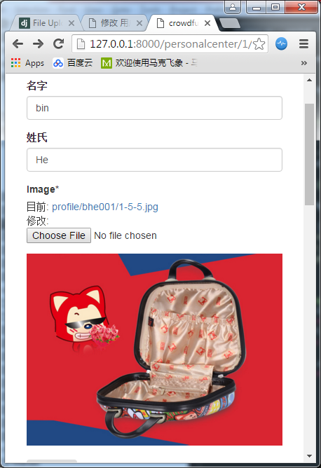
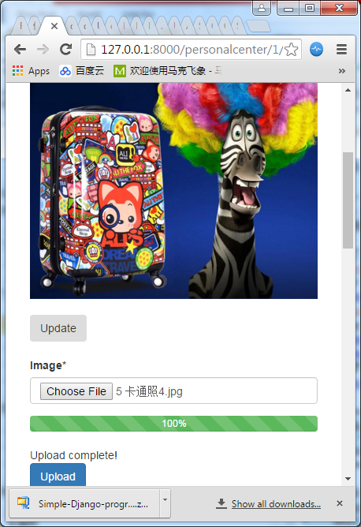

以头像上传为例

# 后台上传

细节可参考ecommerce 017 Image Uploads

https://docs.djangoproject.com/en/1.8/ref/forms/fields/#django.forms.ImageField

在用户里面添加image域，并通过upload_to函数指定保存方法
``` python
def image_upload_to(instance, filename):
    name = instance.username
    title, file_extension = filename.split(".")
    new_filename = "%s-%s.%s" %(instance.id, slugify(title), file_extension)
    return "profile/%s/%s" %(name, new_filename)

class MyUser(AbstractBaseUser, PermissionsMixin):
    image = models.ImageField(upload_to=image_upload_to)
```
media定义
``` python
MEDIA_URL = '/media/'
MEDIA_ROOT = os.path.join(BASE_DIR, "static_in_env", "media_root")
```
文件上传之后
- 后台Admin显示: 
> 目前: profile/bhe001/1-6-lock.jpg
- 访问网站：
> http://127.0.0.1:8000/media/profile/bhe001/1-6-lock.jpg
- 本地文件保存位置：
> d:\virtualenv\zakkabag\zakkabag\static_in_env\media_root\profile\bhe001\1-6-lock.jpg

同样的名字，如果继续覆盖，文件不会被覆盖，而是增加随机数重新拷贝一个
> 目前: profile/bhe001/1-6-lock_Ni9llB7.jpg 

# 前台上传
首先在personalcenter.templates.personcalcenter.profile_detail.html添加img相关元素

显示组件
``` html
{{form}}
```
显示图片
``` html

```


在表单中加入```enctype="multipart/form-data；```如果不加则得不到图片信息，只有路径  
FILES是个字典，它包含每个FileField的键 (或者ImageField，FileField的子类)。这样的话就可以用request.FILES['File']来存放表单中的这些数据了。 

注意request.FILES只有在请求方法为POST，并且发送请求的<form>拥有```enctype="multipart/form-data```属性时，才会包含数据。否则request.FILES为空

``` html





<div class='col-sm-6 col-sm-offset-3'>
	<h3>{{ object }}</h3>
	<form method="POST" enctype="multipart/form-data" action=""> 
		{{form|crispy}}
		
		<br>
		<input type="submit" value='Update' class='btn' />
	</form>
</div>


```

在personalcenter.views.py 中添加对form的处理
``` python
class ProfileDetailView(FormMixin, DetailView):
    model = UserModel
    template_name = "personalcenter/profile_detail.html"
    form_class = MyUserForm 

    def get_context_data(self, *args, **kwargs):
        context = super(ProfileDetailView, self).get_context_data(*args, **kwargs)
        context["form"] = self.form_class(instance = self.get_object())  
        return context

    def get_object(self, *args, **kwargs):
        user_pk = self.kwargs.get("id")
        usemodel = None
        if user_pk:
            usemodel = get_object_or_404(UserModel, pk=user_pk)
        return usemodel 

    def get_success_url(self):
        return reverse("personalcenter", kwargs=self.kwargs)    

    def post(self, request, *args, **kwargs):
        form = self.get_form()

        if form.is_valid():
            usermodel = UserModel.objects.get(id=self.kwargs.get("id"))
            usermodel.first_name = form.cleaned_data['first_name']
            usermodel.last_name = form.cleaned_data['last_name']

            if 'image' in form.cleaned_data:
                usermodel.image = form.cleaned_data['image'] 
            usermodel.save()
            return self.form_valid(form)
        else:
            return self.form_invalid(form)
```

- form class
``` python
form_class = MyUserForm
```
定义form_class，后面通过通过get_form_class()或get_form()获取form相关的内容

初始化
``` python
context["form"] = self.form_class(instance = self.get_object())
```
Profile是DetailView，本来是不带form的，如果要支持image功能，必须支持form，所以我们添加了基类FormMixin。在form_class指定form类型，并且在context里面将form数据传递给templates。这儿根据object内容对form进行了初始化。

如果是CreateView (例如ProductCreateView)，它的基类有FormMixin，所以form_class是默认已定义的，不需要额外添加FormMixin。不过，如果要添加额外的form，同样需要在context里面传递

更新form内容除了通过instance，也可以直接更新queryset，例如form.fields['categories'].queryset = Category.objects.all()

- get_form()
``` python
form = self.get_form()
```
get_form()会根据定义的form_class获取form类，并根据传递的参数初始化或实例化
在该例子中，我们可以用下面句子代替图片信息获取内容```form = self.form_class(request.POST, request.FILES)``

具体可参考```class FormMixin(six.with_metaclass(FormMixinBase, ContextMixin)):```

``` python
class FormMixin(six.with_metaclass(FormMixinBase, ContextMixin)):
    def get_form_class(self):
        """
        Returns the form class to use in this view
        """
        return self.form_class

    def get_form(self, form_class=None):
        """
        Returns an instance of the form to be used in this view.
        """
        if form_class is None:
            form_class = self.get_form_class()
        return form_class(**self.get_form_kwargs())

    def get_form_kwargs(self):
        """
        Returns the keyword arguments for instantiating the form.
        """
        kwargs = {
            'initial': self.get_initial(),
            'prefix': self.get_prefix(),
        }

        if self.request.method in ('POST', 'PUT'):
            kwargs.update({
                'data': self.request.POST,
                'files': self.request.FILES,
            })
        return kwargs
```

- cleaned_data
``` python
usermodel.image = form.cleaned_data['image']
```
该语句获取image对象。也可以通过下面文件处理的方式
``` python
filename=request.FILES['image']
from PIL import Image 
if filename:
    img=Image.open(filename)
img.save(os.path.join(settings.MEDIA_ROOT, photoname))
usermodel.image = photoname
```

效果图如下：



# 上传进度条
具体参考：https://github.com/Tonetete/Simple-Django-progressbar-upload-file-form-with-ajax

该文章有相对详细的讲解，但是内容不全 [Upload to Django with progress bar using Ajax and jQuery](http://www.laurentluce.com/posts/upload-to-django-with-progress-bar-using-ajax-and-jquery/)

用到的技术
- [jQuery Form plugin](http://jquery.malsup.com/form/#download) [github](https://github.com/jquery-form/form)
    - ajaxsubmit
    - [jquery.form.js](http://malsup.github.io/jquery.form.js) 
    - [jquery.form.min.js](http://malsup.github.com/min/jquery.form.min.js)
- progressbar
    - [jQuery progress bar plugin](https://jqueryui.com/progressbar//) 这个当前实现没有，后面可以用这个来代替进度条状态更新的函数
    - [jquery-ui.js](https://code.jquery.com/ui/1.12.1/jquery-ui.js)
    - [jquery-ui.css](https://code.jquery.com/ui/1.12.1/themes/base/jquery-ui.css)
- 文件上传参考函数 https://docs.djangoproject.com/en/1.8/topics/http/file-uploads/

## Form
首先在personalcenter/forms.py里面新增加一个图片上传的form
``` python
class UploadFileForm(forms.Form):
  image = forms.ImageField(widget=forms.FileInput(
    attrs={'required': 'required'}))  # required=True is the default, but not show it validation in template
```
设置required，这样如果不选图片的话，上传会报错


## URL
动态上传会用到两个ajax post地址，在personalcenter/urls.py增加两个URL，分别处理文件上传和状态更新功能
``` python
urlpatterns = [
    url(r'^uploadfile', upload_file, name='upload_file'), 
    url(r'^upload_status$', upload_status, name='upload_status'),
```

对应的template如下 profile_detail.html
``` html


<div class='col-sm-6 col-sm-offset-3'>
    <h3>{{ object }}</h3>
    <form id="form_profile" method="POST" enctype="multipart/form-data" action=""> 
        {{form|crispy}}        
        
        <input type="submit" value='Update' class='btn' />
    </form>

    <br>

    <form id="form_upload"  enctype="multipart/form-data" action="/personalcenter/uploadfile " method="POST"> 
        {{upload_form|crispy}}
        <div class="progress">
          <div class="progress-bar progress-bar-success progress-bar-striped active" role="progressbar" aria-valuenow="0" aria-valuemin="0" aria-valuemax="100" style="width: 0%">
            0%
          </div>
        </div>        
        <div class="processing-file"></div>
        <input id="buttonSubmit" class="btn btn-primary" type="submit" value="Upload" />        
    </form>
</div>


```

该template里面包含两个form，第二个form专门用于上传图片

``` javascript
var options = {
    beforeSubmit:  showRequest,  // pre-submit callback
    success:       showResponse,  // post-submit callback
    error:         showError,
    // other available options:
    url:       "/personalcenter/uploadfile",  // override for form's 'action' attribute
    type:      "post",       // 'get' or 'post', override for form's 'method' attribute
    dataType:  "json"        // 'xml', 'script', or 'json' (expected server response type)
    //clearForm: true        // clear all form fields after successful submit
    //resetForm: true        // reset the form after successful submit

    // $.ajax options can be used here too, for example:
    //timeout:   3000
};

// bind to the form's submit event
$('#form_upload').submit(function() {
    // inside event callbacks 'this' is the DOM element so we first
    // wrap it in a jQuery object and then invoke ajaxSubmit
    // disable submit button for prevent requests
    $("#buttonSubmit").prop("disabled", true);
    $(".processing-file").html("");
    $(this).ajaxSubmit(options); //处理uploadfile
    $(".progress").show();
    url = "/personalcenter/upload_status?key=" + $("input[name=csrfmiddlewaretoken]").val();//处理upload_status，get方式
    progressWorker(url);
    // !!! Important !!!
    // always return false to prevent standard browser submit and page navigation
    return false;
});

function progressWorker(url){
    percent = 0;
    $.ajax({
        url: url,
        async: true,
        dataType: "json",
        contentType: "application/json",
        success: function (progress) {
            if(progress.uploaded && progress.totalsize){
                console.log("Percent: "+percent+"%");
                percent = (progress.uploaded/progress.totalsize) * 100;
                percent = parseInt(percent, 10);
                $('.progress-bar').css('width', percent+'%').attr('aria-valuenow', percent); //更新进度条
                $('.progress-bar').html(percent+"%"); //显示进度内容
            /* Call sleep function before make a new request in order to prevent much
              request to server. Use it wisely... */
            //sleep(1000);
       }

        },
        complete: function(){
            if(percent<100){
                progressWorker(url);
            }
            else{
                $(".processing-file").show();
                $(".processing-file").append('<span class="glyphicon glyphicon-refresh glyphicon-refresh-animate"></span> Processing file, please wait...');
            }
        },
        error: function (jqXHR, textStatus, errorThrown) {
                  if (jqXHR.status == 500) {
                      alert('Internal error: ' + jqXHR.responseText);
                  } else {
                      alert('Unexpected error.');
                  }
       }
    });
}

// post-submit callback
function showResponse(responseText, statusText, xhr, $form)  {
    // for normal html responses, the first argument to the success callback
    // is the XMLHttpRequest object's responseText property

    // if the ajaxSubmit method was passed an Options Object with the dataType
    // property set to 'xml' then the first argument to the success callback
    // is the XMLHttpRequest object's responseXML property

    // if the ajaxSubmit method was passed an Options Object with the dataType
    // property set to 'json' then the first argument to the success callback
    // is the json data object returned by the server

    if(statusText === "success"){
        $(".processing-file").html("");
        $(".processing-file").append(responseText.message);
        // enable submit button again for make requests
        $("#buttonSubmit").prop("disabled", false); //重新enable提交按钮
    }
}
```

上面用到了两个ajax事件，处理上用了不同的实现方法
- /personalcenter/upload_status使用了常用的$.ajax
- /personalcenter/uploadfile使用ajaxSubmit，form里指定的action会被options覆盖

jquery中各个事件执行顺序如下： 
1.ajaxStart(全局事件)  
2.beforeSend  
3.ajaxSend(全局事件)  
4.success当请求成功时调用函数，即status==200;  
5.ajaxSuccess(全局事件)  
6.error  
7.ajaxError (全局事件)  
8.complete当请求完成时调用函数，即status==404、403、302...只要不出错就行  
9.ajaxComplete(全局事件)  
10.ajaxStop(全局事件)  

## view
在personalcenter/views.py增加对两个ajax 的处理

### upload_file
文件上传成功后会调用upload_file，其中会把文件进行保存，文件名放到cache里保存。这样用户真正保存时再把图片关联到model
``` python
from django.core.cache import cache
from django.core.cache.backends.memcached import MemcachedCache

def upload_file(request):
    if request.method == 'POST':
        upload_form = UploadFileForm(request.POST, request.FILES) 
        if upload_form.is_valid():
            filename=request.FILES['image']
            from PIL import Image
            if filename:
                img = Image.open(filename)
                import os
                photopath = os.path.join(settings.MEDIA_ROOT, 'upload')
                if not os.path.exists(photopath):
                    os.makedirs(photopath)
                img.save(os.path.join(photopath, filename.name))
                cache.set('cache_key_upload',os.path.join('upload', filename.name) ,60*15) 
            return HttpResponse(json.dumps({'message': 'Upload complete!'}))
        else:
            return HttpResponse(json.dumps({'message': 'invalid form!'}))
    else:
        form = UploadFileForm()
        #return render_to_response('index.html', {'form': form}, context_instance=RequestContext(request))
        return HttpResponse(json.dumps({'message': 'invalid form!'}))
```

从$('#form_upload').submit(function()，可以看到，form_upload submit提交时会首先处理upload_status，结束之后才会执行执行upload_file

> upload_status  
> [03/Jun/2017 15:00:29] "GET /personalcenter/upload_status?key=6pxOb4jkfnKLUEU28cmIYL6NDVdkYNhm HTTP/1.1" 200 34 
> upload_status  
> [03/Jun/2017 15:00:29] "GET /personalcenter/upload_status?key=6pxOb4jkfnKLUEU28cmIYL6NDVdkYNhm HTTP/1.1" 200 37  
> upload_file  
> [03/Jun/2017 15:00:31] "POST /personalcenter/uploadfile HTTP/1.1" 200 66  

- UploadFileForm(request.POST, request.FILES)
UploadFileForm仅包含图片，且传递时带上request.FILES

- cache.set('cache\_key\_upload',os.path.join('upload', filename.name) ,60\*15)
将文件名存到cache里，此时文件已上传完成

### 进度更新 upload_Status
``` python
def upload_status(request):
    if request.method == 'GET':
        if request.GET['key']: 
            if cache.get(request.GET['key']):
                value = cache.get(request.GET['key']) 
                return HttpResponse(json.dumps(value), content_type="application/json")
            else:
                return HttpResponse(json.dumps({'error':"No csrf value in cache"}), content_type="application/json")
        else:
            return HttpResponse(json.dumps({'error':'No parameter key in GET request'}), content_type="application/json")
    else:
        return HttpResponse(json.dumps({'error':'No GET request'}), content_type="application/json")
```
这儿对返回值得获取包含两步
1. ```request.GET['key']``` , 根据```url = "/personalcenter/upload_status?key=" + $("input[name=csrfmiddlewaretoken]")```在GET里面包含字典{‘key’: csrfmiddlewaretoken }
2. ```cache.get[cache_key]```, 这个cache的key是csrfmiddlewaretoken值。 根据 ```UploadProgressCachedHandler.handle_raw_input```，它会里面会从```self.request.META['CSRF_COOKIE']```获取到当前的csrfmiddlewaretoken，并将cache_key键值设置为这个token，内容为totalsize和uploaded，该函数能根据这个token从UploadProgressCachedHandler的cache里面拿到返回值

具体进度的数据更新在uploadfilehander里面完成
uploadfilehandler
添加配置
``` python
from django.conf import global_settings
FILE_UPLOAD_HANDLERS = ('personalcenter.uploadfilehandler.UploadProgressCachedHandler', ) \
+ global_settings.FILE_UPLOAD_HANDLERS
```

uploadfilehandler.py中定义UploadProgressCachedHandler类，具体参考源码
``` python
class UploadProgressCachedHandler(FileUploadHandler):
    """
    Tracks progress for file uploads.
    The http post request must contain a header or query parameter, we gonna use
    CSRF token generated by GET request for form in the view but you can modified
    according your considerations or parameters.

    For more info, redirect to documentation: https://docs.djangoproject.com/en/1.7/ref/files/uploads/#optional-methods
    """

    def __init__(self, request=None):
        super(UploadProgressCachedHandler, self).__init__(request)
        self.progress_id = None
        self.cache_key = None


    def handle_raw_input(self, input_data, META, content_length, boundary, encoding=None):
        self.content_length = content_length
        if 'CSRF_COOKIE' in self.request.GET:
            self.cache_key = self.request.GET['CSRF_COOKIE']
        elif 'CSRF_COOKIE' in self.request.META:
            self.cache_key = self.request.META['CSRF_COOKIE']
        if self.cache_key:
            cache.set(self.cache_key, {
                'totalsize': self.content_length,
                'uploaded': 0
            })

    def new_file(self, field_name, file_name, content_type, content_length, charset=None, content_type_extra=None):
        pass

    def receive_data_chunk(self, raw_data, start):
        if self.cache_key:
            data = cache.get(self.cache_key)
            data['uploaded'] += self.chunk_size # data size increase
            cache.set(self.cache_key, data)
        return raw_data
    
    def file_complete(self, file_size):
        """
        Called when a file has finished uploading.

        The handler should return an UploadedFile object that will be stored in request.FILES. 
        Handlers may also return None to indicate that the UploadedFile object should come from subsequent upload handlers.
        """
        if self.cache_key:
            data = cache.get(self.cache_key)
            data['uploaded'] = self.content_length
            cache.set(self.cache_key, data)
            time.sleep(2) # sleep for give time to receive final response in request progress bar


    def upload_complete(self):
        """
        Callback signaling that the entire upload (all files) has completed.
        """
        if self.cache_key:
            cache.delete(self.cache_key)
```

添加新的js和css来支持ajaxsubmit和progressbar
``` javascript
    <script src=""></script>
    <script src=""></script>
    <link href="" rel="stylesheet">
```

## View处理

图片上传完成之后，需要将它附着到User对象。这儿通过upload_file里设置的cache: cache_key_upload

DetailView里面将upload_form传给template，保存时从cache中读取当前的image信息
``` python
class ProfileDetailView(FormMixin, DetailView):
      def get_context_data(self, *args, **kwargs):
         context = super(ProfileDetailView, self).get_context_data(*args, **kwargs)
         context["form"] = self.form_class(instance = self.get_object()) 
+        context["upload_form"] = UploadFileForm()
         return context
		 
     def post(self, request, *args, **kwargs):
        form = self.get_form() 
 
         if form.is_valid():
             usermodel = UserModel.objects.get(id=self.kwargs.get("id"))
             usermodel.first_name = form.cleaned_data['first_name']
             usermodel.last_name = form.cleaned_data['last_name']

-            if 'image' in form.cleaned_data:
-                usermodel.image = form.cleaned_data['image']
+            if not cache.get('cache_key_upload',None) is None:
+                usermodel.image = cache.get('cache_key_upload',None) #
+                if cache.has_key('cache_key_upload'):
+                    cache.delete('cache_key_upload')
             usermodel.save()
             return self.form_valid(form)
         else:
+            self.object = self.get_object(*args, **kwargs)
             return self.form_invalid(form)	
```
根据key找到image对象，并将它附着到user对象

效果图如下:



# 缩略图

首先安装PIL

## 使用PIL裁切图片
使用PIL需要引用Image，使用Image的open(file)方法可以返回打开的图片，使用crop((x0,y0,x1,y1))方法可以对图片做裁切。

如下代码示例：
``` python
import Image

img = Image.open(r'E:\photo\20120402\abc.jpg')
region = (100,200,400,500)

#裁切图片
cropImg = img.crop(region)

#保存裁切后的图片
cropImg.save(r'E:\photo\crop.jpg')
```

## 使用PIL制作缩略图

PIL的Image中提供了thumbnail(img,filter)方法,使用这个方法可以很方便的制作缩略图。

```python
img = Image.open(i.avatar.file)
if img.size[0] > 1024 or img.size[1] > 1000:
    newWidth = 1024
    newHeight = float(1024) / img.size[0] * img.size[1]
    img.thumbnail((newWidth,newHeight),Image.ANTIALIAS)

saveToPath = path.join(getUserUploadDirRoot(loginUser.id) , 'original.jpg')
img.save(saveToPath,"JPEG")
```

这一步是在为裁切头像做准备，如果用户上传的图片宽度大于1024时会做一下缩放。

## 使用 Django-thumbs 生成缩略图
Django-thumbs is the easiest way to create thumbnails for your ImageFields with Django.You can integrate it easily in your code and it works with any StorageBackend.

### 特征
- Easy to integrate in your code (no database changes, works as an ImageField)
- Works perfectly with any StorageBackend
- Generates thumbnails after image is uploaded into memory
- Deletes thumbnails when the image file is deleted
- Provides easy access to the thumbnails' URLs (similar method as with ImageField)

### 安装
> $ pip install django-thumbs

### 要点
- Import it in your models.py and replace ```ImageField``` with ```ImageWithThumbsField``` in your model
- Add a sizes attribute with a list of sizes you want to use for the thumbnails
- Make sure your have defined ```MEDIA_URL``` in your ```settings.py```

### 范例
``` python
from django.db import models
from django_thumbs.db.models import ImageWithThumbsField

class Person(models.Model):
    photo = ImageWithThumbsField(upload_to='images', sizes=((125, 125), (200, 200)))
    second_photo = ImageWithThumbsField(upload_to='images')
```

In this example we have a Person model with 2 image fields.

You can see the field second_photo doesn't have a sizes attribute. This field works exactly the same way as a normal ImageField.

The field photo has a sizes attribute specifying desired sizes for the thumbnails. This field works the same way as ImageField but it also creates the desired thumbnails when uploading a new file and deletes the thumbnails when deleting the file.

With ImageField you retrieve the URL for the image with：someone.photo.url With ImageWithThumbsField you retrieve it the same way. You also retrieve the URL for every thumbnail specifying its size：In this example we use someone.photo.url_125x125 and someone.photo.url_200x200 to get the URL of both thumbnails.

### 卸载

At any time you can go back and use ImageField again without altering the database or anything else. Just replace ImageWithThumbsField with ImageField again and make sure you delete the sizes attribute. Everything will work the same way it worked before using django-thumbs. Just remember to delete generated thumbnails in the case you don't want to have them anymore.

### 我的项目

新建 App

> startapp base

settings.py
``` python
INSTALLED_APPS = (
    ...
    'base'
)

MEDIA_URL = '/media/'
MEDIA_ROOT = os.path.join(BASE_DIR, "media")
```

models.py
``` python
# coding:utf-8
from django.db import models
from django_thumbs.db.models import ImageWithThumbsField
import os, datetime, uuid


def generate_filename(instance, filename):
    """
    安全考虑，生成随机文件名
    """
    directory_name = datetime.datetime.now().strftime('photos/%Y/%m/%d')
    filename = uuid.uuid4().hex + os.path.splitext(filename)[-1]
    return os.path.join(directory_name, filename)


class Photo(models.Model):
    name = models.CharField('名称', max_length=10)
    photo = ImageWithThumbsField('照片', upload_to=generate_filename, sizes=((150, 150),))

    def __unicode__(self):
        return self.photo.url_150x150

    class Meta:
        verbose_name_plural = verbose_name = '照片'
```

admin.py
``` python
# coding: utf-8
from django.contrib import admin
from .models import Photo


class PhotoAdmin(admin.ModelAdmin):
    list_display = ('name', 'photo',)


admin.site.register(Photo, PhotoAdmin)
```
> 
> from base.models import Photo  
> ps = Photo.objects.all()  
> ps  
> [<Photo: /media/photos/2016/12/27/02e374320dae43888fc75c4d3041f93b.150x150.jpg>]  

通过控制台由此可得上传图片缩略图的访问地址为：
> http://127.0.0.1:8000/media/photos/2016/12/27/02e374320dae43888fc75c4d3041f93b.150x150.jpg

注意 ：

要想成功访问图片，需要在 urls.py 里面添加以下内容：
``` python
from django.conf.urls import url
from django.conf import settings

urlpatterns = [
    url(r'^media/(?P<path>.*)$', 'django.views.static.serve', {'document_root': settings.MEDIA_ROOT})
]
```


