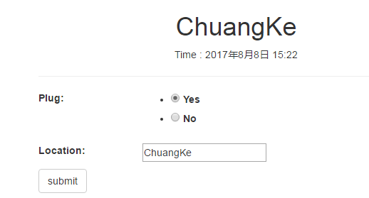
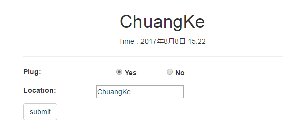
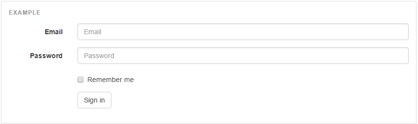

inspection要实现的功能包括检查的统计，创建，修改

urls.py
``` python
from .views import OfficeInspectionListView, OfficeInspectionDetailView, OfficeInspectionCreateView

urlpatterns = [
    url(r'^$', OfficeInspectionListView.as_view(), name='OfficeInspection_list'),
    url(r'^create$', OfficeInspectionCreateView.as_view(), name='OfficeInspection_create'),
    url(r'^(?P<pk>\d+)/$', OfficeInspectionDetailView.as_view(), name='OfficeInspection_detail'), 
]
```

# 表单显示 Form
## 内联单选框 inline
方法一

设置form中的field为 ChoiceField / RadioSelect，在template中它会以ul,li方式进行显示
``` python
class OfficeInspectionForm(forms.ModelForm):
      
    plug = forms.ChoiceField(
            choices=RESULT_OPTION,
            widget = forms.RadioSelect,
            )
```
template中显示如下，各个选项(Yes, No0是竖着显示的，排版不够美观，也不符合纸质使用习惯
``` html
<ul id="id_plug">
  <li>
    <label for="id_plug_0"><input checked="checked" id="id_plug_0" name="plug" type="radio" value="yes"> 
      Yes
    </label>
  </li>
  <li>
    <label for="id_plug_1"><input id="id_plug_1" name="plug" type="radio" value="no"> 
      No
    </label>
  </li>
</ul>
```
显示效果如下



### 隐藏li的默认样式 (去掉圆点)
首选去掉圆点
``` javascript
<style type="text/css">


.field ul{
	list-style:none;
}


</style>
```

### 添加浮动属性
``` javascript

.field li{
	float:left;
}

```
修改后效果



### 参考
[ul li css 做横向菜单](http://www.cnblogs.com/amylis_chen/archive/2011/09/24/2188398.html)

**方法二**

给ul添加两个class .list-inline和.list-unstyled  

list-unstyled
> 移除默认的列表样式，列表项中左对齐 ( \<ul\> 和 \<ol\> 中)。 这个类仅适用于直接子列表项 (如果需要移除嵌套的列表项，你需要在嵌套的列表中使用该样式)	

list-inline
> 将所有列表项放置同一行	

### 参考
http://www.runoob.com/bootstrap/bootstrap-typography.html
	
## 水平表单
参考 http://getbootstrap.com/css/#forms-horizontal

{{ form|crispy }}的显示效果为label单独行，这个对于有些模板排版就不会那么好看

参考bootstrapp horizontal form效果，实现类似效果



它的代码如下：
``` html
<form class="form-horizontal">
  <div class="form-group">
    <label for="inputEmail3" class="col-sm-2 control-label">Email</label>
    <div class="col-sm-10">
      <input type="email" class="form-control" id="inputEmail3" placeholder="Email">
    </div>
  </div>
  <div class="form-group">
    <label for="inputPassword3" class="col-sm-2 control-label">Password</label>
    <div class="col-sm-10">
      <input type="password" class="form-control" id="inputPassword3" placeholder="Password">
    </div>
  </div>
  <div class="form-group">
    <div class="col-sm-offset-2 col-sm-10">
      <div class="checkbox">
        <label>
          <input type="checkbox"> Remember me
        </label>
      </div>
    </div>
  </div>
  <div class="form-group">
    <div class="col-sm-offset-2 col-sm-10">
      <button type="submit" class="btn btn-default">Sign in</button>
    </div>
  </div>
</form>
```
参考它的实现，在项目的实现如下
inspection/horizontal_form.html
``` html
<form class="form-horizontal" method="POST" action=''>
    
        <p style="color: #b75f33;">
            {{form.non_field_errors}}
        </p>
    

    
        
            <div>{{ field }}</div>
        
            <div class="error" style="color:#b75f33">{{ field.errors }}</div>
            <div class="field-area form-group  error">                
                {{ field.label_tag }}                
                <div class="col-sm-10">
                    {{ field }}
                </div>
            </div>
                    
    
    <input type="submit" name="submit" class="btn btn-default" value="submit"/>
</form>
```

template里面添加下面的css
``` html

<script>


$(document).ready(function(){
	$(".field-area input").addClass("form-control");
	$(".field-area textarea").addClass("form-control");
	$(".field-area>label").addClass("col-sm-2 control-label");
});


</script>
```

1. 改例子没有明确地写出每个field的名字，对应的属性(widget, readonly, disable, exclude)可以在form中设置  
2. 显示label内容使用了```{{ field.label_tag }}```，显示field本身```{{ field }}```，这儿无法把 css class 加进去，所以通过JavaScript在页面ready时把label的```control-label```和field的```form-control```添加进去了  
3. column宽度，lable直接添加在label内添加col-sm-2，field的在div里面添加col-sm-10

# 表格
## 自适应表格
http://caibaojian.com/responsive-tables.html  
http://blog.sina.com.cn/s/blog_66d8992d0100pb5i.html

# 多选框、
正常的设置之后，多选框总是无法初始化选择
``` python
class DailyInspectionForm(forms.ModelForm):
   
    impact = forms.MultipleChoiceField(
            choices = lambda: (item for item in DailyInspection.daily_insepction_impact),
            widget = forms.SelectMultiple(),
            #widget=forms.CheckboxSelectMultiple(),
            initial = ['environment'],
            required=True
            )
```
最后查下来应该是django代码bug

```
class SelectMultiple(Select):
    allow_multiple_selected = True

    def render(self, name, value, attrs=None, choices=()):
        if value is None:
            value = []
        final_attrs = self.build_attrs(attrs, name=name)
        output = [format_html('<select multiple="multiple"{}>', flatatt(final_attrs))]
        options = self.render_options(choices, value)
        if options:
            output.append(options)
        output.append('</select>')
        return mark_safe('\n'.join(output))

    def value_from_datadict(self, data, files, name):
        if isinstance(data, (MultiValueDict, MergeDict)):
            return data.getlist(name)
        return data.get(name, None)
	
class Select(Widget):

    def render_options(self, choices, selected_choices):
        # Normalize to strings.
        selected_choices = set(force_text(v) for v in selected_choices)
        output = []
        for option_value, option_label in chain(self.choices, choices):
            if isinstance(option_label, (list, tuple)):
                output.append(format_html('<optgroup label="{}">', force_text(option_value)))
                for option in option_label:
                    output.append(self.render_option(selected_choices, *option))
                output.append('</optgroup>')
            else:
                output.append(self.render_option(selected_choices, option_value, option_label))
        return '\n'.join(output)	
```
```selected_choices = set(force_text(v) for v in selected_choices)```这句话应该改为
``` python
selected_choices = set([force_text(v) for v in selected_choices])
```

参考
- https://stackoverflow.com/questions/9993939/django-display-values-of-the-selected-multiple-choice-field-in-a-template
- https://stackoverflow.com/questions/23572341/initializing-a-multiplechoicefield-in-django-cms
- https://codedump.io/share/cRQMqEnmg5HD/1/django-setting-initial-vals-of-multiplechoicefield-only-works-first-time
- https://stackoverflow.com/questions/25534811/django-display-selected-choices-in-multiplechoicefield
- http://www.programcreek.com/python/example/58199/django.forms.MultipleChoiceField
- https://pypi.python.org/pypi/django-multiselectfield
- [django下ChoiceField等, queryset 动态设定](http://blog.csdn.net/kevin6216/article/details/7103078)

# ImageField 删除
- http://timonweb.com/posts/cleanup-files-and-images-on-model-delete-in-django/
- https://stackoverflow.com/questions/41329858/how-to-delete-an-imagefield-image-in-a-django-model
- https://docs.djangoproject.com/en/1.11/topics/signals/

# 国际化 i18n
Django 官方教程：https://docs.djangoproject.com/en/1.8/#internationalization-and-localization

Django 支持国际化，多语言。Django的国际化是默认开启的，如果您不需要国际化支持，那么您可以在您的设置文件中设置 USE_I18N = False，那么Django会进行一些优化，不加载国际化支持机制。

NOTE: 18表示Internationlization这个单词首字母I和结尾字母N之间的字母有18个。I18N就是Internationlization的意思。

在settings.py文件中设置
``` python
MIDDLEWARE_CLASSES = (
    ...
    'django.middleware.locale.LocaleMiddleware',
)

LANGUAGE_CODE = 'en'
TIME_ZONE = 'UTC'
USE_I18N = True
USE_L10N = True
USE_TZ = True

LANGUAGES = (
    ('en', ('English')),
    ('zh-cn', ('中文简体')),
    ('zh-tw', ('中文繁體')),
)

或者

LANGUAGES = (
    ('en-us', ugettext('English')),
    ('zh-cn', ugettext('Chinese Simple')),
    ('zh-tw', ugettext('Chinese taiwan')),
)

#翻译文件所在目录，需要手工创建
LOCALE_PATHS = (
    os.path.join(BASE_DIR, 'locale'),
)

TEMPLATE_CONTEXT_PROCESSORS = (
    ...
    "django.core.context_processors.i18n",
)
```
生成需要翻译的文件：
```
django-admin.py makemessages -l zh_CN
django-admin.py makemessages -l zh-tw
```
Django 1.9 及以上版本要改成
```
python manage.py makemessages -l zh_hans
python manage.py makemessages -l zh_hant
```
手工翻译 locale 中的 django.po
```
此处省去500字
...
 
 
#: .\tutorial\models.py:23
msgid "created at"
msgstr "创建于"
 
#: .\tutorial\models.py:24
msgid "updated at"
msgstr "更新于"
 
...
此处省去几百字

```
手工翻译 locale 中的文本后，我们需要编译一下，这样翻译才会生效
```
django-admin.py compilemessages

```
下载翻译编辑工具[poedit](http://www.poedit.net/download.php#win32)

如果翻译不生效，请检查你的语言包的文件夹是不是有 中划线，请用下划线代替它。  
比如 zh-hans 改成 zh_hans

[gettext-0.17-win32-setup.exe](http://www.lijiejie.com/python/gettext-0.17-win32-setup.exe)

## 语言的名字
```django.utils.translation.get_language_info```函数可以获取当前版本支持的语言

具体的定义在```django.conf.locale.__init__.py```里的LANG_INFO表中


``` python
LANGUAGES = (
    ('en', ('English')),
    ('zh-cn', ('中文简体')),
    ('zh-tw', ('中文繁體')),
)
```
默认生成的文件里，使用的是en-us，原因不明，但是这会导致语言切换失败
``` python
LANGUAGE_CODE = 'en-us'
```

## 代码中标记
model的定义
``` python
class MyAbstractUser(AbstractBaseUser, PermissionsMixin):
    first_name = models.CharField(_('first name'), max_length=30, blank=True)
```

view的定义
``` python
class DailyInspectionListView(ListView): 
    def dispatch(self, request, *args, **kwargs):
        request.breadcrumbs([
            (_("Home"),reverse("home", kwargs={})),
            (_('Daily Inspection'),request.path_info),
        ])
        return super(DailyInspectionListView, self).dispatch(request,args,kwargs)   
```

模板中的定义

添加“”，然后就可以使用trans标记

``` html
<button type='submit' class='btn btn-default btn-block'></button>
```
如果你只想标记字符串而想以后再翻译，可以添加noop选项：
``` html
<button type='submit' class='btn btn-default btn-block'></button>
```
trans标记只能翻译字符串，不能使用变量，如果有变量需要翻译，那么需要使用标记
``` html
Log in site {{ site_name }}
```
另外RequestContext对象有三个针对翻译的变量LANGUAGES,LANGUAGE_CODE和LANGUAGE_BIDI，分别表示语言列表，当前用户语言的偏好，和语言的书写方式：
> LANGUAGES 是一系列元组组成的列表，每个元组的第一个元素是语言代码，第二个元素是用该语言表示的语言名称。  
LANGUAGE_CODE是以字符串表示的当前用户偏好语言（例如， en-us ）。（详见 Django 如何确定语言偏好。）  
LANGUAGE_BIDI是当前语言的书写方式。若设为 True，则该语言书写方向为从右到左（如希伯来语和阿拉伯语）；若设为 False，则该语言书写方向为从左到右（如英语、法语和德语）。

还有另一种方式，也能达到在模板中使用上面三个变量的目的，如下代码：
``` html




```
这些值其实不需要特别去取，在前面的middleware的process_request里面已经赋值了

## 添加前端
定义一个templatetag，添加langs.py
``` python
# -*- coding:utf-8 -*-
from django import template
from django.utils.translation import get_language_info
from django.conf import settings

LANGUAGES = []
for lang_code in settings.LANGUAGES_SUPPORTED:
	LANGUAGES.append(get_language_info(lang_code))
	
register = template.Library()

@register.inclusion_tag('languages_select_part.html')
def language_select(default):
	return {'languages':LANGUAGES, 'default':default}
```	
在setting.py里添加LANGUAGES_SUPPORTED
``` python
LANGUAGES_SUPPORTED = ('en', 'zh-cn',)
```
“languages_select_part.html”模板的定义如下：
``` html

<form id="language-select-form" method="post" action="">
<select class="dropdown" onchange="this.form.submit();" name="language">
<option value="{{ lang.code }}" selected="selected">{{ lang.name_local }}</option>
</select>
</form>

```
那么在网站的模板中，就可以通过如下代码将该下拉框添加到页面中：



官方文档的实现如下，它用了get_current_language，get_available_languages和get_language_info_list来获取系统language相关的信息

https://docs.djangoproject.com/en/1.8/topics/i18n/translation/#the-set-language-redirect-view

``` python


<form action="" method="post">
    <input name="next" type="hidden" value="{{ redirect_to }}" />
    <select name="language">
        
        
        
        
            <option value="{{ language.code }}" selected="selected">
                {{ language.name_local }} ({{ language.code }})
            </option>
        
    </select>
    <input type="submit" value="Go" />
</form>
```

## 后端的实现 （不修改path）
添加
``` python
url(r'^setlang/$', 'django.views.i18n.set_language', name = 'setlang'),
```

## 后端的原理

django.views.i18n.set_language

该函数会完成语言转换和next设定

``` python
def set_language(request):
    """
    Redirect to a given url while setting the chosen language in the
    session or cookie. The url and the language code need to be
    specified in the request parameters.

    Since this view changes how the user will see the rest of the site, it must
    only be accessed as a POST request. If called as a GET request, it will
    redirect to the page in the request (the 'next' parameter) without changing
    any state.
    """
    next = request.POST.get('next', request.GET.get('next'))
    if not is_safe_url(url=next, host=request.get_host()):
        next = request.META.get('HTTP_REFERER')
        if not is_safe_url(url=next, host=request.get_host()):
            next = '/'
    response = http.HttpResponseRedirect(next)
    if request.method == 'POST':
        lang_code = request.POST.get('language', None)
        if lang_code and check_for_language(lang_code):
            if hasattr(request, 'session'):
                request.session[LANGUAGE_SESSION_KEY] = lang_code
            else:
                response.set_cookie(settings.LANGUAGE_COOKIE_NAME, lang_code,
                                    max_age=settings.LANGUAGE_COOKIE_AGE,
                                    path=settings.LANGUAGE_COOKIE_PATH,
                                    domain=settings.LANGUAGE_COOKIE_DOMAIN)
    return response
```

语言的激活在middleware中完成

django.middleware.locale.py
``` python
class LocaleMiddleware(object):
    def process_request(self, request):
        check_path = self.is_language_prefix_patterns_used()
        language = translation.get_language_from_request(
            request, check_path=check_path)
        translation.activate(language)
        request.LANGUAGE_CODE = translation.get_language()
```

django.utils.translation.trans_real.py

获取language的信息的顺序
- path \en\..
- LANGUAGE_SESSION_KEY
- settings.LANGUAGE_COOKIE_NAME

``` python
def get_language_from_request(request, check_path=False):
    """
    Analyzes the request to find what language the user wants the system to
    show. Only languages listed in settings.LANGUAGES are taken into account.
    If the user requests a sublanguage where we have a main language, we send
    out the main language.

    If check_path is True, the URL path prefix will be checked for a language
    code, otherwise this is skipped for backwards compatibility.
    """
    if check_path:
        lang_code = get_language_from_path(request.path_info)
        if lang_code is not None:
            return lang_code

    supported_lang_codes = get_languages()

    if hasattr(request, 'session'):
        lang_code = request.session.get(LANGUAGE_SESSION_KEY)
        if lang_code in supported_lang_codes and lang_code is not None and check_for_language(lang_code):
            return lang_code

    lang_code = request.COOKIES.get(settings.LANGUAGE_COOKIE_NAME)

    try:
        return get_supported_language_variant(lang_code)
    except LookupError:
        pass

    accept = request.META.get('HTTP_ACCEPT_LANGUAGE', '')
    for accept_lang, unused in parse_accept_lang_header(accept):
        if accept_lang == '*':
            break

        if not language_code_re.search(accept_lang):
            continue

        try:
            return get_supported_language_variant(accept_lang)
        except LookupError:
            continue

    try:
        return get_supported_language_variant(settings.LANGUAGE_CODE)
    except LookupError:
        return settings.LANGUAGE_CODE
```	

## lang url
``` python
from django.conf.urls.i18n import i18n_patterns
urlpatterns += i18n_patterns('',
)
```
如果要全部使用
``` python
from django.conf.urls.i18n import i18n_patterns
urlpatterns = i18n_patterns('',
)
```
To enable change lang url requests add (make sure this is outside i18n_patterns
``` python
(r'^i18n/', include('django.conf.urls.i18n'))
)
```
url的形式如下：
http://127.0.0.1:8000/en/inspection/dailyinspection

切换的时候碰到一点问题，从set_language函数里可以看到，next url首先是从next里面获取，如果没有，则从request.META.get('HTTP_REFERER')里面。

如果不设next，那么request.META.get('HTTP_REFERER')重定向的还是当前的页面（en），切换不成功

在form里设置next，如下
``` python



<form class="navbar-form navbar-left" id="language-select-form" method="post" action="">
	<select class="dropdown form-control" onchange="this.form.submit();" name="language">
		
		<option value="{{ lang.code }}" selected="selected">{{ lang.name_local }}</option>
		
	</select>
	<input name="next" type="hidden" value="{{ request.get_full_path|strip_lang }}" >
</form>

```
``` python
@register.filter(name="strip_lang")
def strip_lang(value):
    lang = translation.get_language()
    print lang, value
    strip_url = '/%s' % value.lstrip('/%s/' % lang)	
    return strip_url
```    

则重定向到http://127.0.0.1:8000/inspection/dailyinspection，这个又是不合法的url，因为url pattern已经改成了i18n_patterns

尝试在middleware中修改next，系统报错这个字典是immutable
``` python
if request.method == "POST":
	lang = request.POST.get("language", None)
	if lang:
		next_url = request.POST.get('next',None)
		if next_url:
			next_url_modified = '/%s%s' % (lang, next_url)
			request.POST.update({'next': next_url_modified})
```			

最后用了修改set_language的方法，照着系统的方法修改了一下
``` python
url(r'^setlang/$', 'zakkabag.views.set_language', name='setlang'),

def set_language(request):
	next = request.POST.get('next', request.GET.get('next'))
	if not is_safe_url(url=next, host=request.get_host()):
		next = request.META.get('HTTP_REFERER', None)
		if not is_safe_url(url=next, host=request.get_host()):
			next = reverse("home", kwargs={}) 
	response = http.HttpResponseRedirect(next)

	lang_code = request.POST.get('language', None) if request.method == 'POST' else request.GET.get('language', None)
	if lang_code and check_for_language(lang_code):
		if hasattr(request, 'session'):
			request.session[LANGUAGE_SESSION_KEY] = lang_code
		else:
			response.set_cookie(settings.LANGUAGE_COOKIE_NAME, lang_code,
				max_age=settings.LANGUAGE_COOKIE_AGE,
				path=settings.LANGUAGE_COOKIE_PATH,
				domain=settings.LANGUAGE_COOKIE_DOMAIN)

	return response
```


## get方式切换语言
模仿后台
``` python
def set_language(request):
	next = request.REQUEST.get('next', None)
	if not next:
		next = request.META.get('HTTP_REFERER', None)
	if not next:
		next = reverse("home", kwargs={}) 
	response = http.HttpResponseRedirect(next)
	if request.method == 'GET':
		lang_code = request.GET.get('language', None)
		if lang_code and check_for_language(lang_code):
			if hasattr(request, 'session'):
				request.session[LANGUAGE_SESSION_KEY] = lang_code
			else:
				response.set_cookie(settings.LANGUAGE_COOKIE_NAME, lang_code)
	return response
```	
前台
``` html
           <li><a href="?language='zh-cn'&next={{request.path}}">chinese</a></li>
           <li><a href="?language='en'&next={{request.path}}">english</a></li>  
```
但是check_for_language这个函数总是失败，实际上还没有进入该函数，在它的wrapper就返回False了

前台也可以用下面方式
``` python
<ul class="lang-switch">
    
      
      
      <li><a href="#" rel="{{ language.code }}">{{ language.code|upper }}</a></li>
      
      
</ul>
```
GET方式没有成功，后面再看吧

## 参考
- https://docs.djangoproject.com/en/1.8/topics/i18n/translation/#explicitly-setting-the-active-language
- [django多语言支持](http://www.it165.net/pro/html/201303/5220.html)
- [Django i18n国际化](http://www.cnblogs.com/oubo/archive/2012/04/05/2433690.html)
- https://stackoverflow.com/questions/21166356/django-i18n-doesnt-change-language
- https://stackoverflow.com/questions/27845749/django-switch-language-with-i18n-pattern-and-normal-url-pattern
- https://stackoverflow.com/questions/5489601/django-i18n-change-language
- https://stackoverflow.com/questions/5816033/django-default-language-i18n
- https://stackoverflow.com/questions/8265077/django-how-to-get-language-code-in-template


# 网页调用摄像头
``` html
<input type="file" accept="video/*;capture=camcorder">
```

# 禁止网页缩放
``` html
<meta name="viewport" content="width=device-width,initial-scale=1,minimum-scale=1.0,maximum-scale=1.0,user-scalable=no"/>
```

# 新浪云直接访问文件存储


 


